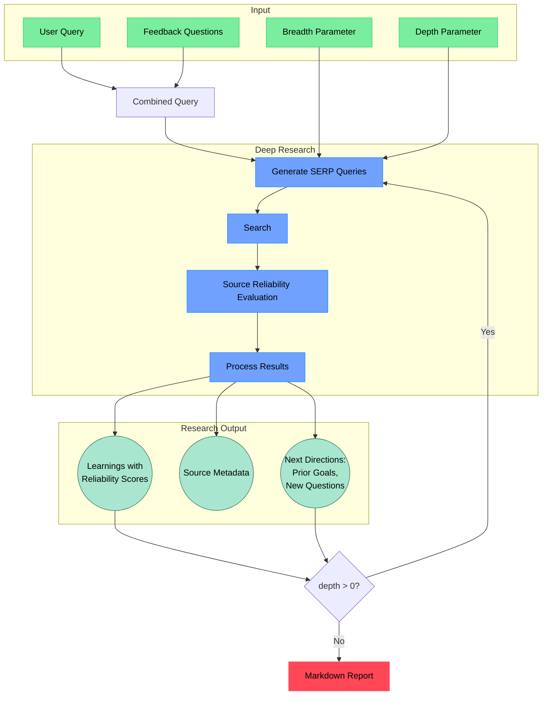

# Open Deep Research MCP Server

Found this on twitter and rigged it to search recent events. My use case was for recent events so I optimized it for that. I would loosely compare it Grok's deepsearch but more expensive and slower. Still a work in progress, trying to get the cost down, and improve report generating. 

## Quick Start

1. Clone and install:
```bash
git clone https://github.com/christiangraham702/deep-research
cd deep-research
npm install
```

2. Set up environment in `.env.local`:
```bash
# Copy the example environment file
cp .env.example .env.local
```

3. Build:
```bash
# Build the server
npm run build
```

4. Run the cli version:
```bash
npm run start "Your research query here"
```
5. Test MCP Server with Claude Desktop:  
Follow the guide thats at the bottom of server quickstart to add the server to Claude Desktop:  
https://modelcontextprotocol.io/quickstart/server

## Features

- Performs deep, iterative research by generating targeted search queries
- Controls research scope with depth (how deep) and breadth (how wide) parameters
- Evaluates source reliability with detailed scoring (0-1) and reasoning
- Prioritizes high-reliability sources (≥0.7) and verifies less reliable information
- Generates follow-up questions to better understand research needs
- Produces detailed markdown reports with findings, sources, and reliability assessments
- Available as a Model Context Protocol (MCP) tool for AI agents
- For now MCP version doesn't ask follow up questions

## Optimizations

This fork includes several optimizations to reduce costs while maintaining research quality:

### Cost Reduction Optimizations

1. **Source Reliability Caching**
   - Added reliability cache to avoid re-evaluating the same domains
   - Implemented rule-based reliability scoring for common domains (Wikipedia, GitHub, YouTube, Reddit)
   - Eliminates redundant LLM calls when the same sources appear multiple times

2. **Optimized Content Processing**
   - Reduced token usage by trimming content length from 25,000 to 15,000 tokens
   - Added content truncation for long documents (limited to 3,000 chars) to save tokens
   - Skip empty results to avoid unnecessary LLM calls
   - More efficient prompt formatting that reduces redundant information

3. **Intelligent Query Generation**
   - Skip LLM calls for follow-up queries by directly converting research directions to queries
   - Reduced the number of learnings passed to query generation (only top 10)
   - Simplified prompt templates to use fewer tokens
   - Added adaptive query count that reduces breadth when sufficient learnings are found
   - Used a more compact format for research directions

4. **Selective Deep Research**
   - Implemented intelligent depth control that only explores promising paths
   - Added prioritization of verification queries and novel directions
   - Reduced search breadth when already have sufficient learnings
   - Early termination for low-value research branches

5. **Report Generation Optimization**
   - Limited the number of learnings sent to the final report (max 40)
   - Restricted conflicting claims to only the top 5 most significant
   - Reduced token limit for learnings from 150k to 100k
   - Limited the sources section to only the top 30 most relevant sources
   - Made prompt templates more concise

### Results of Optimizations

These changes significantly reduce costs through:
- Fewer LLM calls (via caching and selective exploration)
- Reduced tokens per call (via content truncation and efficient prompting)
- Focused resource allocation on high-value research paths

Research quality is maintained by intelligently prioritizing:
- The most reliable sources
- The most promising research directions
- The most significant conflicting claims
- The most recent and relevant content

## Debugging and Prompt Management

This fork adds robust debugging capabilities and centralized prompt management:

### Enhanced Debugging

The system includes a comprehensive debugging module that helps you understand what's happening at each step of the research process:

```bash
# Add to .env.local to enable debugging
DEBUG_MODE=true
DEBUG_LEVEL=3      # 1=ERROR, 2=WARN, 3=INFO, 4=DEBUG, 5=TRACE
DEBUG_PROMPTS=true    # Log all prompts sent to LLMs
DEBUG_RESPONSES=true  # Log all responses from LLMs
DEBUG_PROGRESS=true   # Log progress updates
DEBUG_SOURCES=true    # Log detailed source information
```

Debug output includes:
- Color-coded log levels
- Timing information for performance analysis
- Formatted display of prompts and responses
- Source reliability visualization
- Research progress tracking

### Centralized Prompt Management

All prompts are now centralized in a single location (`src/prompts/index.ts`), making it easy to:

1. **Understand Prompts**: Each prompt is documented with:
   - What it does
   - When it's used
   - Expected inputs and outputs
   - Optimization notes

2. **Modify Prompts**: Change any prompt without hunting through the codebase:
   ```typescript
   // Example: Modify the Source Reliability Evaluation prompt
   export const sourceReliabilityPrompt = (domain: string, context: string) => {
     return `Your custom prompt here...`;
   };
   ```

3. **Add New Prompts**: Easily extend the system with new prompt types:
   ```typescript
   // Example: Add a custom prompt
   export const myCustomPrompt = (param1: string, param2: number) => {
     return `Custom prompt with ${param1} and ${param2}`;
   };
   ```

This structure makes it simple to experiment with different prompt strategies and fine-tune the system for specific research needs.

## How It Works


## Advanced Setup

### Using Local Firecrawl (Free Option)

Instead of using the Firecrawl API, you can run a local instance. You can use the official repo or my fork which uses searXNG as the search backend to avoid using a searchapi key:

1. Set up local Firecrawl:
```bash
git clone https://github.com/Ozamatash/localfirecrawl
cd localfirecrawl
# Follow setup in localfirecrawl README
```

2. Update `.env.local`:
```bash
FIRECRAWL_BASE_URL="http://localhost:3002"
```

### Optional: Observability

Add observability to track research flows, queries, and results using Langfuse:

```bash
# Add to .env.local
LANGFUSE_PUBLIC_KEY="your_langfuse_public_key"
LANGFUSE_SECRET_KEY="your_langfuse_secret_key"
```

The app works normally without observability if no Langfuse keys are provided.

## License

MIT License
